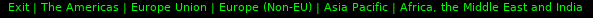

# nordvpn-polybar
This is just polybar module to make you feel cool connecting nordvpn, using openpyn (python script helper)
I used a lot of menus in the module, so that people can have a lot of configurations

Dependencies:
-Polybar 
-Python3 
-openpyn 

# Setup
Please change the directories of the configuration files due to your setup

# Screenshots
Before click  
Menu :  
Settings  
choosing country  
European countries  
choosing protocol  
checking best servers  

