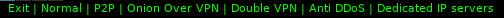

# nordvpn-polybar
This is just polybar module to make you feel cool connecting Nordvpn (VPN provider), using openpyn (python script helper) 
I used a lot of menus in the module, so that people can have a lot of configurations.

# Features
Most of openpyn features are supported which are: 
-Connecting to all countries Nordvpn has. 
-Protocols: TCP or UDP. 
-Server types: Dedicated, P2P, Onion over VPN, Double VPN, Anti DDoS, Dedicated IP Servers 

# Dependencies
-Polybar 
-Python3 
-openpyn 

# Setup
Please change the directories of the configuration files due to your setup

# Screenshots
Before click  
Menu :  
Settings  
choosing country  
European countries  
choosing protocol  
choosing server type:  
checking best servers  

